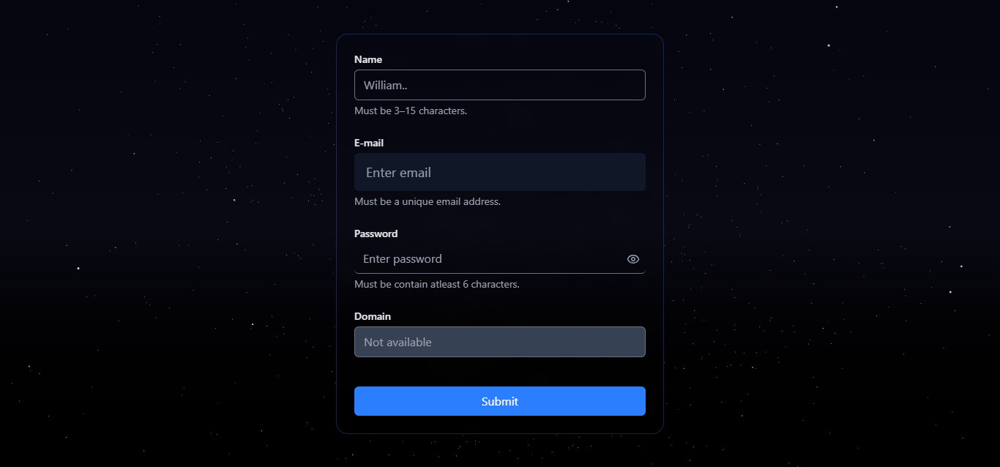
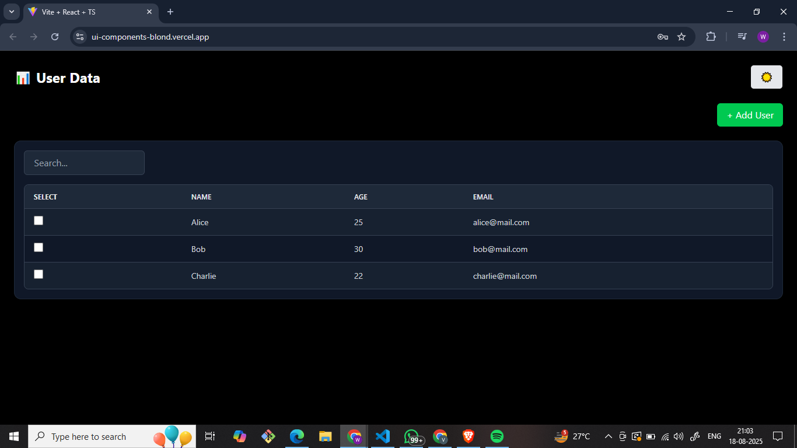

# 🌌 Frontend Assignment – InputField & DataTable Components

A modern frontend assignment built with **React + TypeScript + TailwindCSS + Shadcn UI**.  
It demonstrates reusable form components, an interactive data table, dark/light themes, and animations.  
Deployed on **Vercel** for live preview.

---

## ✨ Features

### 📝 InputField Component
- Variants: **Outlined, Filled, Ghost**
- Sizes: **Small, Medium, Large**
- States: **Error, Disabled, Helper Text**
- Responsive + accessible (`aria-label`, labels)
- Built as a **reusable component** with TypeScript props

### 📊 DataTable Component
- Display tabular data
- Column **sorting**
- Row selection (**single/multiple**)
- **Add/Delete** rows dynamically
- **Search filter** 🔍
- **Pagination**
- **Loading** + **Empty states**
- Dark/Light **mode toggle**

### 🎨 UI/UX
- Clean **dark theme** (with toggle)
- Smooth transitions & animations
- Background stars animation (`StarsCanvas ✨`)
- Fully **responsive** (mobile → desktop)

---

## 🖼️ Screenshots / Demo

| Form Demo | DataTable Demo |
|-----------|----------------|
|  |  |


---

## 🛠️ Tech Stack

- ⚛️ **React + TypeScript**
- 🎨 **TailwindCSS + Shadcn UI**
- 🌗 **Dark/Light Theme** (ThemeProvider + toggle)
- 📖 **Storybook** for component documentation
- ✅ **Jest + React Testing Library** for unit tests
- ▲ **Vercel** for deployment

---

## 🚀 Getting Started

Clone the repo:
```bash
git clone https://github.com/vanshsuri07/UI-Components.git
cd my-components
```


 Install dependencies:
```
npm install
```
 Run dev server:
```
npm run dev
```

## 📖 Storybook

Build Storybook:
```
npm run build-storybook
```
Run locally:
```
npm run storybook
```

## ➡️ Storybook will be live at:
https://ui-components-9xsi.vercel.app/?path=/story/components-datatable--default


## ✅ Tests

Run unit tests with Jest:
```
npm test
```
## 🌌 Deployment

Deployed on Vercel:
https://ui-components-blond.vercel.app/

##📂 Project Structure
```
src/
 ├── components/
 │    ├── InputField/
 │    │    ├── InputField.tsx
 │    │    ├── InputField.stories.tsx
 │    │    └── InputField.test.tsx
 │    ├── DataTable/
 │    │    ├── datatable.tsx
 │    │    ├── DataTable.stories.tsx
 │    │    └── DataTable.test.tsx
 │    ├── Animation.tsx
 │    └── theme-provider.tsx
 ├── App.tsx
 ├── App.css
 └── index.tsx
```


## 📌 Notes

Form inputs are validated with error messages.

DataTable supports dynamic rows (Add/Delete).

Fully responsive for mobile-first design.


## 👨‍💻 Author  
[@vanshsuri07](https://github.com/vanshsuri07)


